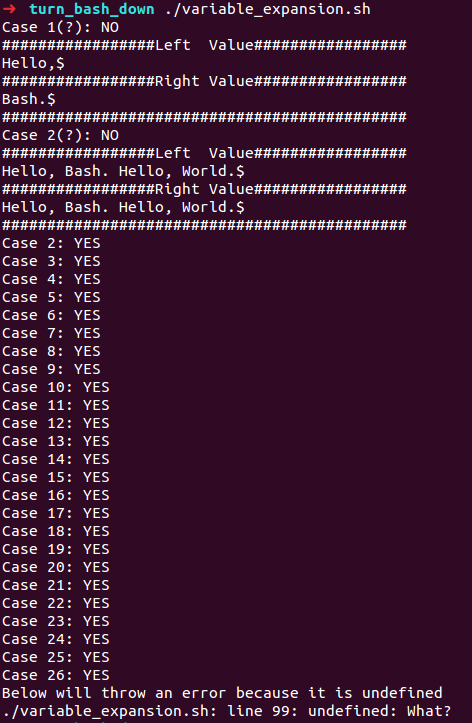

# Turn bash down

Inspired by this [video](https://www.youtube.com/watch?v=yTijxqjZhRo), I created this repo to help learn those tricky usages of _Bash_.

## Files include: 

* [variable_expansion.sh](./variable_expansion.sh): Examples about variable expansions. Run this script and the output is supposed to be:

    

